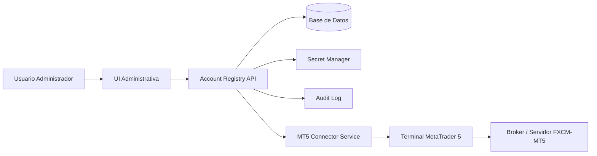
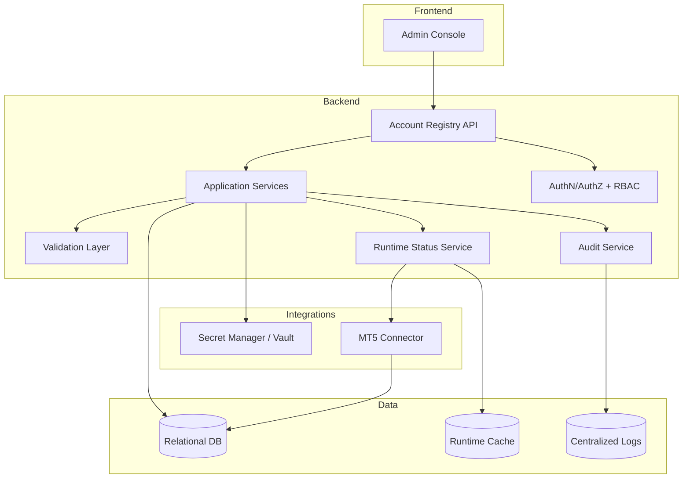
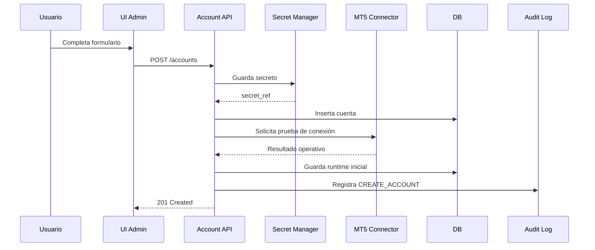
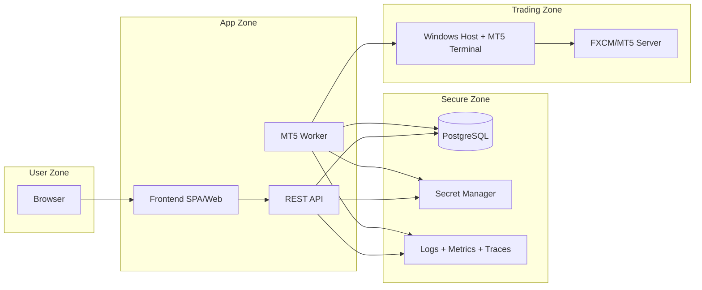
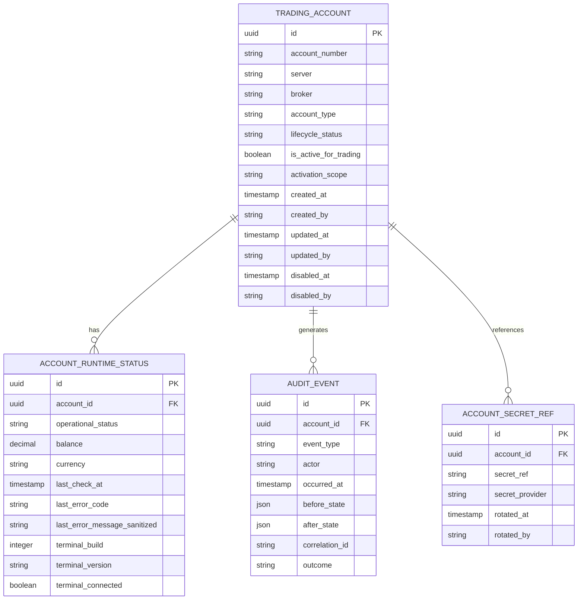

# Software Architecture Design / Diseño Técnico  
## Gestión de Cuentas FXCM/MT5

**Versión:** 1.0  
**Estado:** Propuesta base para implementación  
**Idioma:** Español  
**Fecha:** 2026-04-06  

---

## 1. Propósito del documento

Este documento consolida el diseño de arquitectura, diseño técnico, contrato API, decisiones arquitectónicas, modelo de datos y requisitos no funcionales para el módulo de **gestión de cuentas de trading FXCM/MT5**.

El diseño parte del requerimiento funcional base de una interfaz administrativa que permite listar, crear, editar, deshabilitar y seleccionar la cuenta activa para trading, mostrando además el estado operativo y atributos de cuenta obtenidos desde MetaTrader 5 (MT5).

La solución se define de acuerdo con buenas prácticas de:
- separación de responsabilidades,
- seguridad de secretos,
- auditoría,
- resiliencia operacional,
- diseño REST,
- trazabilidad,
- operación administrada.

---

## 2. Fuentes base y criterios de diseño

### 2.1 Requisitos funcionales de origen
El requerimiento base indica una grilla administrativa con los campos:
- Account
- Server
- Balance
- Divisa
- Tipo
- Condición
- Activa

Y operaciones:
- Crear
- Editar
- Borrar (borrado lógico / inhabilitación)
- Auditoría de creación y eliminación
- Visualización exclusiva de cuentas operativas o inoperativas

### 2.2 Capacidades relevantes de MT5 consideradas en este diseño
El diseño aprovecha capacidades oficiales de la integración Python de MetaTrader 5:
- `initialize()` para establecer conexión con el terminal MT5.
- `login()` para conectar una cuenta específica.
- `account_info()` para consultar datos de la cuenta actual conectada.
- `terminal_info()` para consultar el estado y parámetros del terminal conectado.
- `last_error()` para diagnóstico estandarizado de errores.
- `version()` para validación de versión/build del terminal.

### 2.3 Principios de diseño adoptados
1. **La UI no se conecta directamente a MT5.**
2. **Las credenciales no se guardan en texto plano en la base funcional.**
3. **Los datos operativos en tiempo real se desacoplan del catálogo administrativo.**
4. **El borrado es lógico y auditable.**
5. **Solo puede existir una cuenta activa para trading por ámbito de operación.**
6. **El estado operativo de MT5 es efímero; el estado del registro es persistente.**
7. **Los errores de API deben seguir Problem Details para HTTP APIs.**
8. **Toda operación administrativa relevante debe ser trazable.**

---

# 3. Software Architecture Design

## 3.1 Objetivo arquitectónico

Diseñar un módulo de administración de cuentas FXCM/MT5 que permita:
- registrar cuentas de trading,
- proteger sus credenciales,
- validar conectividad operativa contra MT5,
- exponer un catálogo auditable de cuentas,
- seleccionar una cuenta activa para trading,
- desacoplar la experiencia de usuario del tiempo de respuesta del terminal MT5.

## 3.2 Alcance

Incluye:
- gestión administrativa de cuentas,
- integración backend con terminal MT5,
- almacenamiento de metadatos y auditoría,
- visualización del estado operativo,
- publicación de API REST para el front-end.

No incluye:
- ejecución de órdenes,
- gestión de posiciones,
- estrategia algorítmica,
- cálculo de señales,
- administración de símbolos o portafolios.

## 3.3 Vista de contexto



## 3.4 Vista lógica de componentes



## 3.5 Estilo arquitectónico

Se adopta un estilo **servicio modular desacoplado**, con los siguientes bloques:
- **Frontend administrativo**
- **API de registro de cuentas**
- **Servicio conector MT5**
- **Persistencia relacional**
- **Gestor de secretos**
- **Canal de auditoría y observabilidad**

No se recomienda acoplar la UI directamente al terminal MT5 ni compartir credenciales con el navegador.

## 3.6 Decisiones clave de modelado

### 3.6.1 Separación de estados
Se separan tres conceptos distintos:

1. **Estado operativo**  
   Resultado de la validación contra MT5.
   - `OPERATIVE`
   - `INOPERATIVE`
   - `UNKNOWN`

2. **Estado del registro**
   Estado administrativo persistente.
   - `ENABLED`
   - `DISABLED`

3. **Cuenta activa para trading**
   Flag booleano:
   - `true`
   - `false`

### 3.6.2 Separación catálogo vs. runtime
Se distingue entre:
- **datos de catálogo**: account number, server, broker, tipo, referencias de credencial;
- **datos runtime**: balance, currency, status operativo, último chequeo, error de último chequeo.

Esto evita bloquear la experiencia de usuario por consultas sincrónicas a MT5.

## 3.7 Flujos principales

### 3.7.1 Flujo de alta de cuenta


### 3.7.2 Flujo de edición
1. El usuario selecciona una cuenta.
2. La UI consulta `GET /accounts/{id}`.
3. Se muestran campos editables sin exponer la contraseña actual.
4. Si se actualiza la contraseña, se rota el secreto en el gestor de secretos.
5. Se registra evento de auditoría con antes/después sanitizado.

### 3.7.3 Flujo de deshabilitación
1. El usuario solicita deshabilitar.
2. La API valida que la cuenta exista.
3. Si está activa, se rechaza o se exige reasignación previa.
4. Se actualiza `lifecycle_status = DISABLED`.
5. Se registra `disabled_at`, `disabled_by`.
6. No se elimina físicamente el registro.

### 3.7.4 Flujo de activación de cuenta para trading
1. El usuario solicita activar una cuenta.
2. La API valida:
   - que la cuenta esté `ENABLED`,
   - que no exista otra activa en el mismo ámbito,
   - o ejecuta la desactivación/activación en una única transacción.
3. Se registra auditoría.
4. La API devuelve el nuevo estado consistente.

### 3.7.5 Flujo de validación operativa
1. Job o worker lee cuentas habilitadas.
2. Recupera el secreto desde el vault.
3. Ejecuta:
   - `initialize()`
   - `login()`
   - `account_info()`
   - `terminal_info()`
   - `last_error()` si aplica
4. Actualiza snapshot runtime.
5. Publica métricas y logs.

## 3.8 Consideraciones de seguridad

### 3.8.1 Secretos
- La contraseña no se almacena como columna visible del catálogo principal.
- Debe almacenarse en un **Secret Manager** centralizado.
- La aplicación solo conserva una referencia (`secret_ref` o `credential_id`).
- Debe existir rotación controlada de secreto.
- Nunca se deben escribir secretos en logs, auditoría o respuestas API.

### 3.8.2 Control de acceso
Se recomienda RBAC con al menos:
- `ACCOUNT_ADMIN`
- `ACCOUNT_AUDITOR`
- `OPS_SUPPORT`
- `READ_ONLY`

### 3.8.3 Protección de transporte y datos
- TLS obligatorio para tráfico API.
- Cifrado en reposo para base de datos, respaldos y secretos.
- Hash de integridad o sellado lógico de eventos de auditoría.

## 3.9 Vista de despliegue recomendada



## 3.10 Riesgos principales y mitigaciones

| Riesgo | Impacto | Mitigación |
|---|---:|---|
| UI bloqueada por consultas directas a MT5 | Alto | Runtime cache + worker asíncrono |
| Exposición de credenciales | Crítico | Secret manager + redacción de logs |
| Múltiples cuentas activas simultáneamente | Alto | Restricción transaccional + índice único parcial |
| Estados inconsistentes por timeout MT5 | Alto | `UNKNOWN` + timestamp de último chequeo + reintentos |
| Borrado irreversible de cuentas | Medio | Soft delete auditado |
| Diagnóstico difícil de fallos | Alto | `last_error()`, métricas, correlación de trazas |

---

# 4. Documento de Diseño Técnico

## 4.1 Diseño técnico de alto nivel

La solución se implementa como un backend REST con un componente conector MT5 separado del front-end. El backend mantiene:
- catálogo persistente,
- runtime snapshot,
- auditoría,
- integración con gestor de secretos.

### 4.1.1 Componentes técnicos recomendados
- **Frontend:** React / Angular / Vue o equivalente corporativo.
- **Backend API:** Java/Spring Boot, .NET, Node.js o Python/FastAPI.
- **Worker MT5:** Python por alineación natural con la librería oficial de MetaTrader 5.
- **Base de datos:** PostgreSQL.
- **Secret Manager:** HashiCorp Vault, AWS Secrets Manager, Azure Key Vault o equivalente.
- **Observabilidad:** OpenTelemetry + Prometheus + Grafana + SIEM / logging centralizado.

## 4.2 Diseño de módulos

### 4.2.1 Módulo `account-catalog`
Responsabilidades:
- crear cuentas,
- editar metadatos,
- deshabilitar cuentas,
- listar cuentas,
- obtener detalle.

### 4.2.2 Módulo `account-runtime`
Responsabilidades:
- guardar snapshot del estado operativo,
- exponer balance/divisa/último chequeo,
- informar latencia y fallos recientes.

### 4.2.3 Módulo `account-activation`
Responsabilidades:
- activar una única cuenta,
- garantizar exclusividad,
- auditar cambios.

### 4.2.4 Módulo `mt5-connector`
Responsabilidades:
- inicializar terminal,
- iniciar sesión contra cuenta MT5,
- consultar `account_info()`,
- consultar `terminal_info()`,
- convertir errores de `last_error()` en errores técnicos internos.

### 4.2.5 Módulo `audit`
Responsabilidades:
- capturar eventos administrativos,
- guardar antes/después sanitizado,
- propagar correlation-id.

## 4.3 Reglas de negocio

1. `account_number + server` debe ser único entre cuentas habilitadas.
2. Una cuenta deshabilitada no puede ser activada para trading sin re-habilitación.
3. No puede existir más de una cuenta activa por entorno o ámbito definido.
4. El estado operativo no se edita manualmente desde UI.
5. El balance y la divisa son informativos, derivados de MT5.
6. La contraseña nunca se devuelve al cliente.
7. El borrado es lógico.
8. Toda operación CRUD relevante debe quedar auditada.
9. La edición del secreto debe registrarse como evento de rotación o actualización de credencial.
10. Una validación fallida no elimina ni invalida automáticamente el registro; solo actualiza su runtime status.

## 4.4 Estrategia de validación

### Validaciones sincrónicas en API
- formato de `account_number`,
- obligatoriedad de `server`, `broker`, `account_type`,
- unicidad lógica,
- permisos del usuario.

### Validaciones asíncronas
- prueba de conectividad MT5,
- lectura de balance/divisa,
- estado operativo.

## 4.5 Estrategia de concurrencia

Para activar cuentas:
- usar transacción serializable o locking explícito,
- actualizar primero la cuenta activa actual a `false`,
- luego marcar la nueva cuenta como activa,
- confirmar en una única transacción.

## 4.6 Estrategia de refresco runtime

Modelo recomendado:
- **polling programado** cada 30-120 segundos para cuentas habilitadas,
- refresco bajo demanda mediante endpoint manual de “probar conexión”,
- evitar refresco por cada carga de la pantalla.

## 4.7 Estrategia de errores

- Errores de negocio: HTTP 4xx.
- Errores de integración MT5: HTTP 502/503 según el caso.
- Error payload conforme a **Problem Details for HTTP APIs**.
- Nunca propagar secretos, stack traces ni información sensible al cliente.

## 4.8 Estrategia de logging

Registrar:
- intentos de alta, edición, deshabilitación, activación,
- pruebas de conexión,
- cambios de secreto (sin el secreto),
- errores técnicos con correlation-id,
- latencia y código lógico del error.

No registrar:
- contraseñas,
- tokens,
- respuestas con material sensible,
- dumps completos de configuración del terminal si incluyen datos sensibles.

## 4.9 Estrategia de observabilidad

### Métricas mínimas
- `accounts_total`
- `accounts_enabled_total`
- `accounts_operational_total`
- `mt5_connection_checks_total`
- `mt5_connection_check_failures_total`
- `mt5_connection_check_latency_ms`
- `active_account_switch_total`

### Logs estructurados
Campos sugeridos:
- `timestamp`
- `level`
- `service`
- `operation`
- `account_id`
- `account_number_masked`
- `server`
- `correlation_id`
- `outcome`
- `mt5_error_code`

### Trazas
- flujo UI -> API -> DB -> Vault -> Worker -> MT5

## 4.10 Estrategia de pruebas

### Unitarias
- validaciones,
- mapeos de DTO,
- reglas de negocio,
- redacción de secretos.

### Integración
- repositorios,
- control transaccional,
- contrato API,
- simulación del conector MT5.

### End-to-End
- crear cuenta,
- editar cuenta,
- deshabilitar cuenta,
- activar cuenta,
- probar conexión.

### Seguridad
- control de acceso,
- pruebas de fuga de secretos,
- validación de logs,
- hardening de endpoints.

---

# 5. Especificación de Interfaz de API / Contrato

## 5.1 Convenciones generales

- Base path: `/api/v1`
- Formato: `application/json`
- Fechas: ISO 8601 UTC
- Identificadores: UUID
- Errores: RFC 9457 Problem Details
- Autenticación: Bearer token / sesión corporativa
- Idempotencia:
  - `PUT` y `DELETE` lógicos deben ser idempotentes cuando aplique

## 5.2 Recursos principales

- `/accounts`
- `/accounts/{accountId}`
- `/accounts/{accountId}/activation`
- `/accounts/{accountId}/connectivity-check`
- `/accounts/{accountId}/secret`
- `/audit/accounts/{accountId}`

## 5.3 Modelo de representación pública

```json
{
  "id": "6a5d71bb-8b31-4c32-81f5-c8c16d425221",
  "accountNumber": "105291044",
  "server": "MetaQuotes-Demo",
  "broker": "FXCM",
  "accountType": "DEMO",
  "lifecycleStatus": "ENABLED",
  "isActiveForTrading": true,
  "runtime": {
    "operationalStatus": "OPERATIVE",
    "balance": 7050.02,
    "currency": "USD",
    "lastCheckAt": "2026-04-06T14:21:36Z",
    "lastErrorCode": null,
    "lastErrorMessage": null
  },
  "createdAt": "2026-04-06T12:00:00Z",
  "createdBy": "admin.user",
  "updatedAt": "2026-04-06T14:21:36Z",
  "updatedBy": "system.mt5-worker"
}
```

## 5.4 Endpoints

### 5.4.1 Listar cuentas
**GET** `/api/v1/accounts`

#### Query params
- `lifecycleStatus`
- `operationalStatus`
- `isActiveForTrading`
- `page`
- `size`
- `sort`

#### Respuesta 200
```json
{
  "items": [
    {
      "id": "6a5d71bb-8b31-4c32-81f5-c8c16d425221",
      "accountNumber": "105291044",
      "server": "MetaQuotes-Demo",
      "broker": "FXCM",
      "accountType": "DEMO",
      "lifecycleStatus": "ENABLED",
      "isActiveForTrading": true,
      "runtime": {
        "operationalStatus": "OPERATIVE",
        "balance": 7050.02,
        "currency": "USD",
        "lastCheckAt": "2026-04-06T14:21:36Z"
      }
    }
  ],
  "page": 0,
  "size": 20,
  "total": 1
}
```

### 5.4.2 Obtener detalle de cuenta
**GET** `/api/v1/accounts/{accountId}`

#### Respuesta 200
```json
{
  "id": "6a5d71bb-8b31-4c32-81f5-c8c16d425221",
  "accountNumber": "105291044",
  "server": "MetaQuotes-Demo",
  "broker": "FXCM",
  "accountType": "DEMO",
  "lifecycleStatus": "ENABLED",
  "isActiveForTrading": true,
  "runtime": {
    "operationalStatus": "OPERATIVE",
    "balance": 7050.02,
    "currency": "USD",
    "lastCheckAt": "2026-04-06T14:21:36Z"
  }
}
```

### 5.4.3 Crear cuenta
**POST** `/api/v1/accounts`

#### Request
```json
{
  "accountNumber": "105291044",
  "server": "MetaQuotes-Demo",
  "broker": "FXCM",
  "accountType": "DEMO",
  "secret": {
    "password": "******"
  },
  "requestConnectivityCheck": true
}
```

#### Regla
- El secreto se consume solo para alta/rotación; no se devuelve.
- `requestConnectivityCheck=true` dispara validación asíncrona o síncrona corta según configuración.

#### Respuesta 201
```json
{
  "id": "6a5d71bb-8b31-4c32-81f5-c8c16d425221",
  "accountNumber": "105291044",
  "server": "MetaQuotes-Demo",
  "broker": "FXCM",
  "accountType": "DEMO",
  "lifecycleStatus": "ENABLED",
  "isActiveForTrading": false,
  "runtime": {
    "operationalStatus": "UNKNOWN",
    "balance": null,
    "currency": null,
    "lastCheckAt": null
  }
}
```

### 5.4.4 Editar metadatos de cuenta
**PUT** `/api/v1/accounts/{accountId}`

#### Request
```json
{
  "server": "MetaQuotes-Demo",
  "broker": "FXCM",
  "accountType": "REAL"
}
```

#### Respuesta 200
```json
{
  "id": "6a5d71bb-8b31-4c32-81f5-c8c16d425221",
  "accountNumber": "105291044",
  "server": "MetaQuotes-Demo",
  "broker": "FXCM",
  "accountType": "REAL",
  "lifecycleStatus": "ENABLED",
  "isActiveForTrading": false
}
```

### 5.4.5 Rotar/actualizar secreto
**PUT** `/api/v1/accounts/{accountId}/secret`

#### Request
```json
{
  "password": "******",
  "reason": "Credential rotation"
}
```

#### Respuesta 204
Sin cuerpo.

### 5.4.6 Deshabilitar cuenta
**DELETE** `/api/v1/accounts/{accountId}`

#### Comportamiento
- Soft delete
- Cambia `lifecycleStatus` a `DISABLED`
- Registra auditoría
- No elimina registros físicos

#### Respuesta 204
Sin cuerpo.

### 5.4.7 Rehabilitar cuenta
**POST** `/api/v1/accounts/{accountId}/enable`

#### Respuesta 200
```json
{
  "id": "6a5d71bb-8b31-4c32-81f5-c8c16d425221",
  "lifecycleStatus": "ENABLED"
}
```

### 5.4.8 Activar cuenta para trading
**POST** `/api/v1/accounts/{accountId}/activation`

#### Request
```json
{
  "activate": true,
  "scope": "GLOBAL"
}
```

#### Respuesta 200
```json
{
  "accountId": "6a5d71bb-8b31-4c32-81f5-c8c16d425221",
  "isActiveForTrading": true,
  "switchedAt": "2026-04-06T14:30:12Z"
}
```

### 5.4.9 Probar conectividad
**POST** `/api/v1/accounts/{accountId}/connectivity-check`

#### Respuesta 202
```json
{
  "accountId": "6a5d71bb-8b31-4c32-81f5-c8c16d425221",
  "status": "ACCEPTED",
  "message": "Connectivity check scheduled"
}
```

### 5.4.10 Ver auditoría de cuenta
**GET** `/api/v1/audit/accounts/{accountId}`

#### Respuesta 200
```json
{
  "items": [
    {
      "eventId": "5d8926e2-048a-4afe-84c0-5486339d3fe8",
      "eventType": "CREATE_ACCOUNT",
      "performedBy": "admin.user",
      "performedAt": "2026-04-06T12:00:00Z",
      "summary": "Account created"
    },
    {
      "eventId": "6d2f5db9-7f65-4104-a7a4-17f0ae3d5d45",
      "eventType": "ROTATE_SECRET",
      "performedBy": "admin.user",
      "performedAt": "2026-04-06T12:10:00Z",
      "summary": "Credential rotated"
    }
  ]
}
```

## 5.5 Error contract

### 5.5.1 Ejemplo de error de validación
```json
{
  "type": "https://example.com/problems/validation-error",
  "title": "Validation error",
  "status": 400,
  "detail": "accountNumber is required",
  "instance": "/api/v1/accounts",
  "correlationId": "e57b2d5f-09bc-4ca8-8bb7-3f47dc53fb89"
}
```

### 5.5.2 Ejemplo de error de integración MT5
```json
{
  "type": "https://example.com/problems/mt5-connection-failed",
  "title": "MT5 connection failed",
  "status": 502,
  "detail": "The MT5 connector could not validate the account",
  "instance": "/api/v1/accounts/6a5d71bb-8b31-4c32-81f5-c8c16d425221/connectivity-check",
  "correlationId": "700d5cc9-657f-4514-b9f6-f638e0cd0f8a",
  "mt5ErrorCode": -10005
}
```

## 5.6 Códigos de estado HTTP sugeridos

| Endpoint | Método | Éxito | Errores frecuentes |
|---|---|---:|---|
| `/accounts` | GET | 200 | 401, 403 |
| `/accounts/{id}` | GET | 200 | 404 |
| `/accounts` | POST | 201 | 400, 409, 422 |
| `/accounts/{id}` | PUT | 200 | 400, 404, 409 |
| `/accounts/{id}/secret` | PUT | 204 | 400, 404 |
| `/accounts/{id}` | DELETE | 204 | 404, 409 |
| `/accounts/{id}/enable` | POST | 200 | 404, 409 |
| `/accounts/{id}/activation` | POST | 200 | 404, 409, 422 |
| `/accounts/{id}/connectivity-check` | POST | 202 | 404, 503 |

---

# 6. Registro de Decisiones Arquitectónicas (ADR)

## ADR-001 — Desacoplar la UI del terminal MT5
**Estado:** Aceptada

### Contexto
La propuesta inicial se enfocaba en una pantalla CRUD que muestra atributos derivados de MT5.

### Decisión
La UI consumirá solo la API backend; el backend integrará con MT5 mediante un worker/conector.

### Consecuencias
- mejor seguridad,
- menor acoplamiento,
- mejor resiliencia,
- mayor complejidad operativa controlada.

---

## ADR-002 — Separar catálogo persistente y estado runtime
**Estado:** Aceptada

### Contexto
Balance, divisa y condición dependen del estado actual del terminal/cuenta.

### Decisión
Persistir catálogo y runtime en modelos separados.

### Consecuencias
- mejora performance de la UI,
- evita lecturas directas a MT5 en cada render,
- permite retener histórico de chequeos.

---

## ADR-003 — Usar gestor centralizado de secretos
**Estado:** Aceptada

### Contexto
La clave de acceso a cuenta MT5 es información altamente sensible.

### Decisión
Guardar credenciales en un Secret Manager y solo almacenar referencias en la DB transaccional.

### Consecuencias
- mejora postura de seguridad,
- habilita rotación,
- simplifica auditoría del uso del secreto,
- agrega dependencia de infraestructura.

---

## ADR-004 — Soft delete en lugar de borrado físico
**Estado:** Aceptada

### Contexto
El requerimiento exige auditoría de creación y borrado.

### Decisión
Implementar deshabilitación lógica.

### Consecuencias
- se preserva historial,
- se minimiza pérdida accidental,
- requiere filtrar por `lifecycle_status`.

---

## ADR-005 — Única cuenta activa por ámbito
**Estado:** Aceptada

### Contexto
La operación demanda una sola cuenta activa para trading.

### Decisión
Imponer regla de exclusividad mediante transacción y restricción a nivel DB.

### Consecuencias
- elimina ambigüedad operacional,
- reduce riesgo de ejecución con cuenta incorrecta,
- requiere control fuerte de concurrencia.

---

## ADR-006 — Error contract estandarizado con Problem Details
**Estado:** Aceptada

### Contexto
Las APIs administrativas deben ser consistentes y fáciles de integrar.

### Decisión
Adoptar RFC 9457 para errores.

### Consecuencias
- mejora DX,
- facilita troubleshooting,
- obliga a disciplina en el mapeo de errores.

---

## ADR-007 — Worker MT5 en Python
**Estado:** Aceptada

### Contexto
La integración oficial de MT5 está disponible para Python.

### Decisión
Implementar el conector/worker con Python.

### Consecuencias
- menor fricción técnica con MT5,
- mayor cercanía a la API oficial,
- posible heterogeneidad tecnológica respecto del backend principal.

---

# 7. Modelo de Datos / Diccionario

## 7.1 Modelo lógico



## 7.2 Tablas propuestas

### 7.2.1 `trading_account`

| Campo | Tipo sugerido | Nulo | Descripción |
|---|---|---|---|
| `id` | UUID | No | Identificador técnico |
| `account_number` | VARCHAR(32) | No | Número de cuenta MT5 |
| `server` | VARCHAR(128) | No | Servidor de la cuenta |
| `broker` | VARCHAR(128) | No | Broker o marca operativa |
| `account_type` | VARCHAR(16) | No | `DEMO` / `REAL` |
| `lifecycle_status` | VARCHAR(16) | No | `ENABLED` / `DISABLED` |
| `is_active_for_trading` | BOOLEAN | No | Cuenta activa para operar |
| `activation_scope` | VARCHAR(32) | No | Ámbito de unicidad de activación |
| `created_at` | TIMESTAMP WITH TIME ZONE | No | Fecha de creación |
| `created_by` | VARCHAR(128) | No | Actor de creación |
| `updated_at` | TIMESTAMP WITH TIME ZONE | No | Fecha de actualización |
| `updated_by` | VARCHAR(128) | No | Actor de actualización |
| `disabled_at` | TIMESTAMP WITH TIME ZONE | Sí | Fecha de deshabilitación |
| `disabled_by` | VARCHAR(128) | Sí | Actor de deshabilitación |

#### Restricciones
- `CHECK (account_type IN ('DEMO','REAL'))`
- `CHECK (lifecycle_status IN ('ENABLED','DISABLED'))`

### 7.2.2 `account_runtime_status`

| Campo | Tipo sugerido | Nulo | Descripción |
|---|---|---|---|
| `id` | UUID | No | Identificador técnico |
| `account_id` | UUID | No | FK a `trading_account` |
| `operational_status` | VARCHAR(16) | No | `OPERATIVE` / `INOPERATIVE` / `UNKNOWN` |
| `balance` | NUMERIC(19,4) | Sí | Balance actual |
| `currency` | VARCHAR(8) | Sí | Divisa del balance |
| `last_check_at` | TIMESTAMP WITH TIME ZONE | Sí | Última validación |
| `last_error_code` | VARCHAR(32) | Sí | Código técnico de MT5 |
| `last_error_message_sanitized` | VARCHAR(512) | Sí | Mensaje seguro |
| `terminal_build` | INTEGER | Sí | Build MT5 observada |
| `terminal_version` | VARCHAR(64) | Sí | Versión observada |
| `terminal_connected` | BOOLEAN | Sí | Estado del terminal |

### 7.2.3 `account_secret_ref`

| Campo | Tipo sugerido | Nulo | Descripción |
|---|---|---|---|
| `id` | UUID | No | Identificador técnico |
| `account_id` | UUID | No | FK a cuenta |
| `secret_ref` | VARCHAR(256) | No | Referencia al secreto |
| `secret_provider` | VARCHAR(64) | No | Vault/KMS/Secret Manager |
| `rotated_at` | TIMESTAMP WITH TIME ZONE | Sí | Última rotación |
| `rotated_by` | VARCHAR(128) | Sí | Actor de rotación |

### 7.2.4 `audit_event`

| Campo | Tipo sugerido | Nulo | Descripción |
|---|---|---|---|
| `id` | UUID | No | ID del evento |
| `account_id` | UUID | Sí | Cuenta afectada |
| `event_type` | VARCHAR(64) | No | Tipo de evento |
| `actor` | VARCHAR(128) | No | Usuario o sistema |
| `occurred_at` | TIMESTAMP WITH TIME ZONE | No | Fecha del evento |
| `before_state` | JSONB | Sí | Estado anterior sanitizado |
| `after_state` | JSONB | Sí | Estado posterior sanitizado |
| `correlation_id` | VARCHAR(64) | Sí | Trazabilidad |
| `outcome` | VARCHAR(32) | No | `SUCCESS` / `FAILURE` |

## 7.3 Índices recomendados

### `trading_account`
- índice único compuesto sobre `(account_number, server, lifecycle_status)` según la política elegida;
- o mejor: índice único parcial sobre `(account_number, server)` para registros habilitados;
- índice parcial/único para garantizar una sola cuenta activa por `activation_scope`.

### `account_runtime_status`
- índice por `account_id`
- índice por `operational_status`
- índice por `last_check_at`

### `audit_event`
- índice por `account_id, occurred_at desc`
- índice por `correlation_id`

## 7.4 DDL de referencia (PostgreSQL)

```sql
CREATE TABLE trading_account (
    id UUID PRIMARY KEY,
    account_number VARCHAR(32) NOT NULL,
    server VARCHAR(128) NOT NULL,
    broker VARCHAR(128) NOT NULL,
    account_type VARCHAR(16) NOT NULL CHECK (account_type IN ('DEMO', 'REAL')),
    lifecycle_status VARCHAR(16) NOT NULL CHECK (lifecycle_status IN ('ENABLED', 'DISABLED')),
    is_active_for_trading BOOLEAN NOT NULL DEFAULT FALSE,
    activation_scope VARCHAR(32) NOT NULL DEFAULT 'GLOBAL',
    created_at TIMESTAMPTZ NOT NULL,
    created_by VARCHAR(128) NOT NULL,
    updated_at TIMESTAMPTZ NOT NULL,
    updated_by VARCHAR(128) NOT NULL,
    disabled_at TIMESTAMPTZ NULL,
    disabled_by VARCHAR(128) NULL
);

CREATE TABLE account_runtime_status (
    id UUID PRIMARY KEY,
    account_id UUID NOT NULL REFERENCES trading_account(id),
    operational_status VARCHAR(16) NOT NULL CHECK (operational_status IN ('OPERATIVE', 'INOPERATIVE', 'UNKNOWN')),
    balance NUMERIC(19,4) NULL,
    currency VARCHAR(8) NULL,
    last_check_at TIMESTAMPTZ NULL,
    last_error_code VARCHAR(32) NULL,
    last_error_message_sanitized VARCHAR(512) NULL,
    terminal_build INTEGER NULL,
    terminal_version VARCHAR(64) NULL,
    terminal_connected BOOLEAN NULL
);

CREATE TABLE account_secret_ref (
    id UUID PRIMARY KEY,
    account_id UUID NOT NULL REFERENCES trading_account(id),
    secret_ref VARCHAR(256) NOT NULL,
    secret_provider VARCHAR(64) NOT NULL,
    rotated_at TIMESTAMPTZ NULL,
    rotated_by VARCHAR(128) NULL
);

CREATE TABLE audit_event (
    id UUID PRIMARY KEY,
    account_id UUID NULL REFERENCES trading_account(id),
    event_type VARCHAR(64) NOT NULL,
    actor VARCHAR(128) NOT NULL,
    occurred_at TIMESTAMPTZ NOT NULL,
    before_state JSONB NULL,
    after_state JSONB NULL,
    correlation_id VARCHAR(64) NULL,
    outcome VARCHAR(32) NOT NULL
);

CREATE UNIQUE INDEX uq_trading_account_enabled
ON trading_account(account_number, server)
WHERE lifecycle_status = 'ENABLED';

CREATE UNIQUE INDEX uq_one_active_account_per_scope
ON trading_account(activation_scope)
WHERE is_active_for_trading = TRUE AND lifecycle_status = 'ENABLED';

CREATE INDEX ix_runtime_account_id
ON account_runtime_status(account_id);

CREATE INDEX ix_runtime_operational_status
ON account_runtime_status(operational_status);

CREATE INDEX ix_runtime_last_check_at
ON account_runtime_status(last_check_at);

CREATE INDEX ix_audit_account_time
ON audit_event(account_id, occurred_at DESC);

CREATE INDEX ix_audit_correlation_id
ON audit_event(correlation_id);
```

---

# 8. Documento de Requisitos No Funcionales

## 8.1 Seguridad

### RNF-SEC-01
La solución debe almacenar secretos exclusivamente en un gestor de secretos corporativo o equivalente.

### RNF-SEC-02
La API no debe devolver ni registrar contraseñas o secretos en texto plano.

### RNF-SEC-03
Todo acceso administrativo debe requerir autenticación y autorización por rol.

### RNF-SEC-04
Los eventos de auditoría deben registrar actor, fecha, acción, entidad y resultado.

### RNF-SEC-05
La solución debe usar TLS en tránsito y cifrado en reposo para base, backups y secretos.

### RNF-SEC-06
Los logs deben redactar datos sensibles y evitar material secreto.

## 8.2 Disponibilidad y resiliencia

### RNF-AVL-01
El backend administrativo debe soportar degradación controlada cuando MT5 no esté disponible.

### RNF-AVL-02
La UI debe poder listar cuentas usando el último snapshot runtime disponible.

### RNF-AVL-03
Las pruebas de conectividad deben tener timeout configurable.

### RNF-AVL-04
Debe existir reintento controlado y backoff para fallos transitorios de integración MT5.

## 8.3 Performance

### RNF-PERF-01
`GET /accounts` debe responder en p95 <= 500 ms para hasta 500 cuentas, usando datos de snapshot y paginación.

### RNF-PERF-02
`GET /accounts/{id}` debe responder en p95 <= 300 ms.

### RNF-PERF-03
La activación de cuenta debe completar en p95 <= 700 ms en condiciones normales.

### RNF-PERF-04
Las pruebas de conectividad pueden ser asíncronas para no degradar la experiencia de usuario.

## 8.4 Escalabilidad

### RNF-SCAL-01
La solución debe escalar horizontalmente en la API administrativa.

### RNF-SCAL-02
La carga de validaciones MT5 debe ser procesable por workers independientes.

### RNF-SCAL-03
El diseño debe soportar múltiples brokers/servidores sin rediseño estructural.

## 8.5 Observabilidad

### RNF-OBS-01
Toda petición debe incorporar `correlation-id`.

### RNF-OBS-02
La solución debe emitir logs estructurados, métricas y trazas distribuidas.

### RNF-OBS-03
Debe existir alerta cuando la tasa de fallos de conectividad MT5 supere un umbral definido.

## 8.6 Auditoría y cumplimiento

### RNF-AUD-01
Crear, editar, rotar secreto, deshabilitar, habilitar, activar y probar conectividad deben ser eventos auditables.

### RNF-AUD-02
Los cambios deben guardar estado anterior y posterior sanitizado.

### RNF-AUD-03
La auditoría debe ser consultable por cuenta y por rango temporal.

## 8.7 Mantenibilidad

### RNF-MNT-01
El diseño debe separar API, dominio, persistencia y conectores externos.

### RNF-MNT-02
El conector MT5 debe poder mockearse para pruebas automatizadas.

### RNF-MNT-03
La documentación técnica debe versionarse junto al código.

## 8.8 Compatibilidad y operación

### RNF-OPS-01
La versión/build del terminal MT5 debe poder consultarse y registrarse.

### RNF-OPS-02
Debe existir endpoint de healthcheck para API y para disponibilidad del worker.

### RNF-OPS-03
Los parámetros operativos deben ser configurables por entorno:
- timeout MT5
- frecuencia de polling
- límite de reintentos
- nivel de log
- proveedor de secretos
- política de activación por ámbito

## 8.9 Usabilidad operativa

### RNF-UX-01
La UI debe diferenciar visualmente:
- estado del registro,
- estado operativo,
- cuenta activa.

### RNF-UX-02
La contraseña no debe precargarse al editar; debe usarse un flujo de actualización explícito.

### RNF-UX-03
La grilla debe soportar paginación, ordenamiento y filtros.

---

# 9. Recomendaciones específicas de interfaz de usuario

## 9.1 Columnas recomendadas
- Cuenta
- Servidor
- Broker
- Tipo
- Balance
- Divisa
- Estado operativo
- Estado de registro
- Activa
- Última validación
- Acciones

## 9.2 Acciones recomendadas
- Crear
- Editar
- Actualizar credencial
- Probar conexión
- Activar para trading
- Deshabilitar
- Rehabilitar
- Ver auditoría

## 9.3 Convenciones UX
- No borrar automáticamente un campo al enfocarlo.
- Mostrar confirmación fuerte para deshabilitar.
- Mostrar tooltip con detalle del último error técnico sanitizado.
- Resaltar la cuenta activa con distintivo visual, no solo booleano textual.
- Mostrar estados con semántica visual consistente:
  - verde: `OPERATIVE`
  - rojo: `INOPERATIVE`
  - gris/ámbar: `UNKNOWN`

---

# 10. Criterios de aceptación técnicos

## 10.1 Catálogo
- Se puede crear una cuenta sin exponer ni persistir la contraseña en la tabla principal.
- No se permiten duplicados habilitados de `(account_number, server)`.

## 10.2 Activación
- Solo una cuenta habilitada puede permanecer activa por `activation_scope`.

## 10.3 Runtime
- El balance, divisa y estado operativo se actualizan desde MT5 y no son editables desde UI.

## 10.4 Auditoría
- Crear, editar, deshabilitar y activar generan eventos consultables.

## 10.5 Seguridad
- No existen contraseñas visibles en API, logs ni auditoría.

## 10.6 Errores
- Los errores API usan Problem Details.
- Los errores MT5 son sanitizados antes de exponerse.

---

# 11. Roadmap técnico sugerido

## Fase 1
- Catálogo de cuentas
- Secret manager
- Soft delete
- Auditoría
- Listado administrativo

## Fase 2
- Worker MT5
- Snapshot runtime
- Probar conectividad
- Activación exclusiva de cuenta

## Fase 3
- Métricas, dashboards, alertas
- Histórico de validaciones
- Hardening y pruebas de resiliencia

---

# 12. Referencias técnicas y normativas

1. **MetaTrader 5 Python Integration**
   - `initialize()`  
   - `login()`  
   - `account_info()`  
   - `terminal_info()`  
   - `last_error()`  
   - `version()`

2. **OWASP Cheat Sheet Series**
   - Secrets Management Cheat Sheet
   - Logging Cheat Sheet

3. **IETF**
   - RFC 9457: Problem Details for HTTP APIs

4. **PostgreSQL Documentation**
   - Constraints
   - Partial Indexes
   - CREATE INDEX

---

# 13. Anexo A — Ejemplo de pseudocódigo para validación MT5

```python
def validate_mt5_account(mt5_client, terminal_path, account_number, server, password):
    connected = mt5_client.initialize(
        path=terminal_path,
        login=account_number,
        password=password,
        server=server,
        timeout=60000
    )
    if not connected:
        code, message = mt5_client.last_error()
        return {
            "operational_status": "INOPERATIVE",
            "balance": None,
            "currency": None,
            "terminal_connected": False,
            "last_error_code": str(code),
            "last_error_message_sanitized": sanitize(message),
        }

    authorized = mt5_client.login(
        account_number,
        password=password,
        server=server,
        timeout=60000
    )
    if not authorized:
        code, message = mt5_client.last_error()
        return {
            "operational_status": "INOPERATIVE",
            "balance": None,
            "currency": None,
            "terminal_connected": True,
            "last_error_code": str(code),
            "last_error_message_sanitized": sanitize(message),
        }

    account = mt5_client.account_info()
    terminal = mt5_client.terminal_info()

    if account is None:
        code, message = mt5_client.last_error()
        return {
            "operational_status": "INOPERATIVE",
            "balance": None,
            "currency": None,
            "terminal_connected": bool(terminal),
            "last_error_code": str(code),
            "last_error_message_sanitized": sanitize(message),
        }

    return {
        "operational_status": "OPERATIVE",
        "balance": account.balance,
        "currency": account.currency,
        "terminal_connected": bool(terminal),
        "terminal_version": "unknown" if terminal is None else getattr(terminal, "build", None),
        "last_error_code": None,
        "last_error_message_sanitized": None,
    }
```

---

# 14. Anexo B — Recomendación de nombres de enums

## 14.1 `AccountType`
- `DEMO`
- `REAL`

## 14.2 `LifecycleStatus`
- `ENABLED`
- `DISABLED`

## 14.3 `OperationalStatus`
- `OPERATIVE`
- `INOPERATIVE`
- `UNKNOWN`

## 14.4 `AuditEventType`
- `CREATE_ACCOUNT`
- `UPDATE_ACCOUNT`
- `ROTATE_SECRET`
- `DISABLE_ACCOUNT`
- `ENABLE_ACCOUNT`
- `ACTIVATE_ACCOUNT`
- `DEACTIVATE_ACCOUNT`
- `CONNECTIVITY_CHECK_REQUESTED`
- `CONNECTIVITY_CHECK_COMPLETED`
- `CONNECTIVITY_CHECK_FAILED`

---

# 15. Anexo C — Recomendación de campos de auditoría por evento

| Evento | Campos mínimos |
|---|---|
| `CREATE_ACCOUNT` | actor, occurred_at, account_id, after_state |
| `UPDATE_ACCOUNT` | actor, occurred_at, account_id, before_state, after_state |
| `ROTATE_SECRET` | actor, occurred_at, account_id, secret_provider, outcome |
| `DISABLE_ACCOUNT` | actor, occurred_at, account_id, reason, before_state, after_state |
| `ACTIVATE_ACCOUNT` | actor, occurred_at, account_id, previous_active_account_id, scope |
| `CONNECTIVITY_CHECK_COMPLETED` | actor=system, occurred_at, account_id, mt5_error_code, runtime_snapshot |

---

# 16. Resumen ejecutivo

La solución propuesta transforma el requerimiento inicial de un CRUD visual en una **arquitectura administrativa segura y operable** para cuentas FXCM/MT5. El diseño desacopla interfaz y terminal MT5, protege secretos, separa catálogo y runtime, incorpora auditoría completa y define un contrato API consistente con estándares actuales. Con ello se reduce el riesgo operativo, se mejora la mantenibilidad y se habilita una evolución controlada hacia escenarios multi-cuenta y multi-broker.
