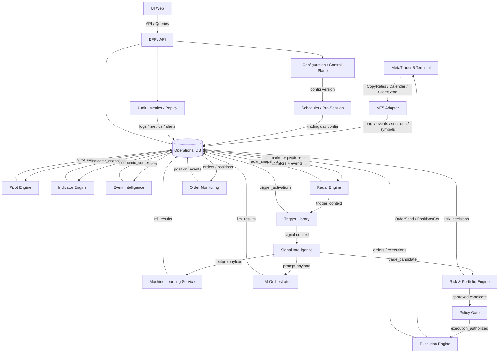

# Documento de Diseño Técnico: Radar Trading Intelligence Platform

## Overview

Radar Trading Intelligence Platform es un sistema modular de análisis, priorización, control de riesgo y ejecución asistida/automatizada para activos operados desde MetaTrader 5 (MT5). El sistema está orientado a detectar oportunidades operativas mediante la combinación de datos de mercado, pivotes calculados localmente, indicadores técnicos incrementales, eventos económicos nativos de MT5, una librería de `trigger_type`, modelos de Machine Learning y consultas estructuradas a un LLM.

La plataforma sigue una **arquitectura modular por dominios** (Clean Architecture + DDD simplificado + CQRS para lectura/escritura), donde cada componente tiene una responsabilidad única, interfaces definidas y límites claros entre captura de datos, detección de contexto, inteligencia de señal, riesgo y ejecución. MT5 actúa como adaptador de mercado y ejecución; el backend local actúa como cerebro del sistema; la UI web sirve para configuración, monitoreo, auditoría y operación.

El flujo principal de datos es:

```text
MT5 Market Data / Economic Calendar
            ↓
        MT5 Adapter
            ↓
Market Cache + Operational DB
            ↓
   Pivot Engine / Indicator Engine / Event Intelligence
            ↓
         Radar Engine
            ↓
        Trigger Library
            ↓
      Signal Intelligence
      ↙               ↘
Machine Learning   LLM Orchestrator
            ↓
 Risk & Portfolio Engine
            ↓
        Policy Gate
            ↓
      Execution Engine (MT5)
            ↓
      Order Monitoring
            ↓
   Audit / Metrics / Replay
```

El **Configuration / Control Plane** gestiona toda la configuración maestra del sistema: activos monitoreados, perfiles por tipo de activo, triggers habilitados, plantillas de prompts, ventanas de evento, reglas de riesgo y horarios operativos. El **Scheduler / Pre-Session Engine** prepara la jornada, congela pivotes, actualiza eventos y publica la configuración operativa diaria.

### Principios Arquitectónicos

| Principio | Implementación |
|-----------|---------------|
| **Separación de Responsabilidades** | El sistema divide la lógica en dominios: configuración, mercado, radar, triggers, inteligencia, riesgo, ejecución, monitoreo y auditoría. |
| **MT5 como Adaptador** | MT5 es fuente primaria de datos y ejecución, pero no contiene el grueso de la lógica de negocio. |
| **Radar como Motor de Estado** | El radar observa, persiste snapshots y emite candidatos; no envía órdenes directamente. |
| **Trigger Library Reutilizable** | La activación de setups vive en una librería de `trigger_type` versionable y configurable. |
| **Cálculo Incremental** | Indicadores y estados técnicos se actualizan con la última vela cerrada y la ventana mínima necesaria. |
| **Persistencia Operativa** | La base operativa es la fuente de lectura para radar, UI, auditoría, replay y prompts; evita consultas repetitivas a MT5. |
| **Fail-Safe** | Ante incertidumbre o fallo, el sistema bloquea, degrada o rechaza; prioridad absoluta: preservación de capital. |
| **Trazabilidad Completa** | `correlation_id` vincula snapshots, triggers, prompts, decisiones de riesgo, órdenes y eventos de monitoreo. |
| **Broker Truth** | Ante discrepancias entre estado local y MT5, prevalece el broker; el sistema reconcilia su estado local. |
| **Configuración Versionada** | Toda regla, perfil, prompt, trigger y política de riesgo se publica con versión y auditoría. |
| **Validación en Frontera** | Datos de entrada, configuración y respuestas externas se validan con schemas antes de incorporarse al dominio. |

### Stack Tecnológico

| Componente | Tecnología |
|------------|-----------|
| Lenguaje backend | Python 3.10+ con tipado estricto (`mypy`) |
| Plataforma broker | MetaTrader 5 Terminal Build 3000+ |
| Lenguaje/adapter broker | MQL5 + `WebRequest` + funciones de series/calendario |
| Base de datos operativa | PostgreSQL 15+ |
| Cache runtime | Redis opcional / cache en memoria |
| Configuración | YAML / JSON versionado |
| Logging | JSON structured logging |
| Validación | `pydantic` v2 |
| Cálculo numérico | `pandas`, `numpy` |
| UI web | React / Next.js o equivalente |
| API interna | FastAPI o equivalente |
| Entorno local | Windows 10/11 Pro + MT5 + backend local |
| Despliegue futuro | VM Windows o Linux (según adapter) |

---

## Architecture

### Capas de Clean Architecture

```text
┌────────────────────────────────────────────────────────────────────────────┐
│                          PRESENTATION LAYER                               │
│ UI Web │ BFF / API │ Dashboard │ Configuración │ Auditoría │ Observabilidad │
├────────────────────────────────────────────────────────────────────────────┤
│                           APPLICATION LAYER                               │
│ Orchestrator │ Scheduler │ AssetCatalog │ PivotEngine │ IndicatorEngine   │
│ EventIntelligence │ RadarEngine │ TriggerLibrary │ SignalOrchestrator    │
│ MLService │ LLMOrchestrator │ RiskEngine │ PolicyGate │ ExecutionService  │
│ OrderMonitoring │ AuditService                                         │
├────────────────────────────────────────────────────────────────────────────┤
│                              DOMAIN LAYER                                 │
│ Entities: Asset, PivotSet, IndicatorSnapshot, RadarSnapshot, Trigger      │
│ TradeCandidate, RiskDecision, OrderIntent, PositionLifecycle              │
│ Value Objects: CorrelationId, TriggerType, SessionWindow, RiskMode        │
│ Interfaces: IMarketGateway, IConfigStore, ITrigger, IRiskPolicy,          │
│ ILLMClient, IExecutionGateway, IAuditSink                                 │
├────────────────────────────────────────────────────────────────────────────┤
│                         INFRASTRUCTURE LAYER                              │
│ MT5Adapter │ PostgresRepository │ CacheStore │ FileLogger │ AlertChannel  │
│ PromptRenderer │ MetricsCollector │ JobRunner │ SecretsProvider           │
├────────────────────────────────────────────────────────────────────────────┤
│                          PERSISTENCE LAYER                                │
│ PostgreSQL: assets, bars, pivots, indicators, events, radar_snapshots,   │
│ triggers, ml_results, llm_requests, llm_results, risk_decisions, orders, │
│ positions, config_versions, audit_records                                 │
└────────────────────────────────────────────────────────────────────────────┘
```

### Diagrama de Componentes



### Flujo de Datos con Correlation ID

```text
[MT5 Bar / Session / Economic Event]
      │
      ▼ correlation_id = UUID4()
[MT5 Adapter] ──→ bars / events / sessions / asset_sync
      │
      ▼ correlation_id propagado
[Pivot Engine / Indicator Engine / Event Intelligence]
      │
      ▼ correlation_id propagado
[Radar Engine] ──→ radar_snapshots (estado por símbolo)
      │
      ▼ correlation_id propagado
[Trigger Library] ──→ trigger_activations (tipo, prioridad, reason_codes)
      │
      ▼ correlation_id propagado
[Signal Intelligence] ──→ ml_results / llm_requests / llm_results / trade_candidate
      │
      ▼ correlation_id propagado
[Risk & Portfolio Engine] ──→ risk_decisions
      │
      ▼ correlation_id propagado
[Policy Gate] ──→ execution_authorized / execution_blocked
      │
      ▼ correlation_id propagado
[Execution Engine] ──→ orders / order_events / positions
      │
      ▼ correlation_id propagado
[Audit / Metrics / Replay] ──→ audit_records / metrics / alerts / replay_index
```

### Gestión de Estado del Sistema

El sistema mantiene un estado global persistente en PostgreSQL:

| Estado | Descripción |
|--------|-------------|
| `STARTING` | Secuencia de inicio en progreso |
| `READY` | Sistema operativo, acepta snapshots y análisis |
| `PAPER_ONLY` | MT5 de ejecución no disponible; solo simulación |
| `DEGRADED` | Componente no crítico con problemas; operación restringida |
| `PREPARING_DAY` | Scheduler preparando la jornada |
| `INTRADAY_FREEZE` | Solo cierres y gestión de posiciones existentes |
| `CIRCUIT_ACTIVE` | Riesgo bloquea nuevas operaciones |
| `EMERGENCY_STOP` | Kill-switch activo; no se permite operar |
| `STOPPED_GRACEFUL` | Apagado limpio completado |
| `FORCED_STOP` | Apagado forzado; requiere reconciliación |

### Máquina de Estado del Radar por Símbolo

| Estado | Descripción |
|--------|-------------|
| `IDLE` | Símbolo sin contexto operativo relevante |
| `WATCHLIST` | Símbolo monitoreado con sesgo o cercanía creciente |
| `IN_ZONE` | Precio dentro de banda de evaluación de pivote |
| `TRIGGERED` | Uno o más triggers activados |
| `UNDER_ANALYSIS` | Payload generado y enviado a ML/LLM o en evaluación final |
| `APPROVED` | Candidato aprobado por señal/riesgo/política |
| `BLOCKED` | Candidato o símbolo bloqueado por riesgo, horario o evento |

---

## Components and Interfaces

### Interfaces del Dominio

Todas las interfaces residen en `src/domain/interfaces/`. Los componentes concretos implementan estas interfaces y se inyectan vía el Orchestrator.

```python
# src/domain/interfaces/i_market_gateway.py
from abc import ABC, abstractmethod
from datetime import datetime
from typing import List, Optional
from src.domain.entities import OHLCVBar, EconomicEvent, SessionWindow, OrderIntent, ExecutionResult, Position

class IMarketGateway(ABC):
    @abstractmethod
    def sync_symbols(self) -> list[str]: ...
    @abstractmethod
    def fetch_bars(self, symbol: str, timeframe: str,
                   from_ts: datetime, to_ts: datetime) -> List[OHLCVBar]: ...
    @abstractmethod
    def fetch_events(self, from_ts: datetime, to_ts: datetime) -> List[EconomicEvent]: ...
    @abstractmethod
    def get_sessions(self, symbol: str) -> List[SessionWindow]: ...
    @abstractmethod
    def submit_order(self, order: OrderIntent) -> ExecutionResult: ...
    @abstractmethod
    def get_position(self, symbol: str) -> Optional[Position]: ...

# src/domain/interfaces/i_trigger.py
from abc import ABC, abstractmethod
from src.domain.entities import TriggerContext, TriggerResult

class ITrigger(ABC):
    @abstractmethod
    def type(self) -> str: ...
    @abstractmethod
    def priority(self) -> int: ...
    @abstractmethod
    def evaluate(self, context: TriggerContext) -> TriggerResult: ...

# src/domain/interfaces/i_risk_policy.py
from abc import ABC, abstractmethod
from src.domain.entities import TradeCandidate, RiskDecision

class IRiskPolicy(ABC):
    @abstractmethod
    def evaluate(self, candidate: TradeCandidate) -> RiskDecision: ...

# src/domain/interfaces/i_llm_client.py
from abc import ABC, abstractmethod
from src.domain.entities import LLMRequest, LLMResult

class ILLMClient(ABC):
    @abstractmethod
    def analyze(self, request: LLMRequest) -> LLMResult: ...

# src/domain/interfaces/i_config_store.py
from abc import ABC, abstractmethod
from src.domain.entities import ActiveSystemConfig, TradingDayConfig

class IConfigStore(ABC):
    @abstractmethod
    def get_active_config(self) -> ActiveSystemConfig: ...
    @abstractmethod
    def publish_config(self, draft_id: str) -> str: ...
    @abstractmethod
    def get_trading_day_config(self, session_date: str) -> TradingDayConfig: ...
```

### Componente 1: Configuration / Control Plane

**Responsabilidad**: Gestionar la configuración maestra del sistema y publicar versiones activas.

**Ubicación**: `src/application/configuration/`

**Funciones clave**:
- `load_active_config()` — Obtiene la configuración vigente
- `publish_config_version()` — Publica una nueva versión de configuración
- `rollback_config_version()` — Revierte a una versión anterior
- `assign_profiles_to_asset()` — Asocia perfiles por símbolo
- `validate_config_semantics()` — Valida coherencia de reglas, triggers, prompts y riesgo

**Decisiones de diseño**:
- Toda configuración se modifica en borrador y luego se publica.
- Cada cambio queda auditado con usuario, fecha y motivo.
- La configuración está separada del radar y de la ejecución.
- Soporta perfiles por tipo de activo y override por símbolo.

### Componente 2: Scheduler / Pre-Session Engine

**Responsabilidad**: Preparar la jornada y generar la configuración operativa diaria.

**Ubicación**: `src/application/scheduler/`

**Funciones clave**:
- `prepare_trading_day()` — Construye la configuración operativa del día
- `run_pre_session_analysis()` — Ejecuta análisis previos a la apertura
- `freeze_daily_pivots()` — Congela pivotes del día
- `refresh_economic_context()` — Actualiza eventos y ventanas macro
- `publish_trading_day_config()` — Publica parámetros operativos listos para Radar

**Decisiones de diseño**:
- Usa jobs en `T-60`, `T-30`, `T-15` y apertura de sesión.
- Debe ser idempotente por símbolo y día.
- Los fallos parciales se registran como `PARTIAL_PREPARED`.
- El scheduler no genera señales; solo deja listo el contexto del día.

### Componente 3: MT5 Adapter

**Responsabilidad**: Conectar MT5 con el backend para datos de mercado, sesiones, eventos y ejecución.

**Ubicación**: `src/infrastructure/mt5/`

**Funciones clave**:
- `sync_symbols()` — Descubre y sincroniza activos desde MT5
- `fetch_bars()` — Obtiene OHLC por símbolo/timeframe
- `fetch_sessions()` — Consulta horarios de trading del símbolo
- `fetch_economic_events()` — Obtiene eventos del calendario económico
- `submit_order()` — Envía órdenes a MT5
- `poll_positions()` — Consulta posiciones activas y estado de órdenes

**Decisiones de diseño**:
- El adaptador usa `CopyRates`, `SymbolInfoSessionTrade`, Economic Calendar y `WebRequest` donde corresponda.
- La lógica de negocio no vive aquí.
- La publicación hacia backend se hace con payloads JSON y retries controlados.
- Toda orden debe viajar con `correlation_id` y `request_id`.

### Componente 4: Asset Catalog

**Responsabilidad**: Mantener el universo de activos, su clasificación y su estado operativo.

**Ubicación**: `src/application/asset_catalog/`

**Funciones clave**:
- `discover_assets_from_mt5()`
- `classify_asset()`
- `enable_asset()` / `disable_asset()`
- `assign_asset_profiles()`
- `get_radar_active_assets()`

**Decisiones de diseño**:
- La clasificación automática se valida manualmente desde UI.
- Los símbolos se agrupan por tipo de activo y por mercado.
- Cada activo puede tener perfiles distintos de riesgo, prompts, triggers y sesiones.

### Componente 5: Market Cache + Operational DB

**Responsabilidad**: Persistir snapshots operativos y servir lecturas rápidas al resto del sistema.

**Ubicación**: `src/infrastructure/persistence/`

**Funciones clave**:
- `store_bar()`
- `store_market_snapshot()`
- `store_runtime_state()`
- `get_latest_bar()`
- `get_latest_market_state()`
- `archive_old_records()`

**Decisiones de diseño**:
- La base operativa es la fuente de lectura del sistema, no MT5 directamente.
- La escritura por tick se limita; el sistema privilegia barras cerradas y snapshots relevantes.
- Soporta replay y auditoría sin consultar nuevamente el broker.

### Componente 6: Pivot Engine

**Responsabilidad**: Calcular pivotes confiables usando OHLC cerrados del broker.

**Ubicación**: `src/application/pivot_engine/`

**Funciones clave**:
- `calculate_daily_pivots()`
- `calculate_session_pivots()`
- `publish_pivot_set()`
- `build_pivot_bands()`

**Decisiones de diseño**:
- El cálculo usa OHLC cerrados desde MT5; no consume pivotes de terceros.
- El tipo inicial recomendado es `Classic`.
- Los pivotes se congelan hasta el siguiente cambio de sesión configurado.
- Se guardan fórmula, origen de datos y versión.

### Componente 7: Indicator Engine

**Responsabilidad**: Calcular indicadores y patrones técnicos de forma incremental.

**Ubicación**: `src/application/indicator_engine/`

**Funciones clave**:
- `update_indicators_on_bar_close()`
- `compute_h4_bias()`
- `compute_execution_indicators()`
- `compute_patterns()`
- `validate_indicator_snapshot()`

**Decisiones de diseño**:
- El cálculo se dispara con la última vela cerrada.
- No se recalcula todo el histórico salvo en bootstrap.
- Los indicadores se versionan para reproducibilidad.
- Los patrones multi-vela recalculan sólo una ventana pequeña `k`.

### Componente 8: Event Intelligence

**Responsabilidad**: Interpretar eventos económicos y traducirlos en contexto operativo por activo.

**Ubicación**: `src/application/event_intelligence/`

**Funciones clave**:
- `load_events_for_day()`
- `map_events_to_assets()`
- `build_event_windows()`
- `compute_risk_mode()`
- `override_event_mapping()`

**Decisiones de diseño**:
- Usa la importancia nativa de MT5.
- La asociación automática se hace por clase de activo y divisa/mercado.
- Los eventos generan estados `NORMAL`, `CAUTION`, `BLOCK_PRE_EVENT`, `BLOCK_POST_EVENT`.

### Componente 9: Radar Engine

**Responsabilidad**: Observar el estado operativo de cada símbolo y emitir candidatos a análisis.

**Ubicación**: `src/application/radar/`

**Funciones clave**:
- `update_radar_state()`
- `evaluate_pivot_proximity()`
- `evaluate_indicator_context()`
- `evaluate_event_context()`
- `create_radar_snapshot()`
- `emit_opportunity_detected()`

**Decisiones de diseño**:
- Radar evalúa en M15 y/o M5 según configuración.
- Persiste la condición operativa del día por símbolo y tipo de activo.
- No crea órdenes; solo candidatos y snapshots.
- Puede evaluar precio en tick solo para proximidad fina, pero la lógica principal se gatilla por vela cerrada.

### Componente 10: Trigger Library

**Responsabilidad**: Encapsular la lógica reusable de activación de setups.

**Ubicación**: `src/application/triggers/`

**Funciones clave**:
- `register_trigger_type()`
- `evaluate_trigger()`
- `apply_cooldown()`
- `suppress_conflicts()`
- `persist_trigger_activation()`

**Catálogo inicial**:
- `pivot_approach`
- `pivot_breakout`
- `pivot_rejection`
- `trend_alignment`
- `event_proximity`
- `technical_fundamental_confluence`
- `volatility_regime_change`
- `session_open_setup`
- `news_risk_block`
- `post_event_reentry`

**Decisiones de diseño**:
- Se implementa con Strategy + Factory + Registry.
- Cada trigger devuelve `activated`, `priority`, `pre_score`, `reason_codes` y `cooldown_seconds`.
- El catálogo es configurable desde Control Plane.
- Todas las activaciones quedan persistidas.

### Componente 11: Signal Intelligence

**Responsabilidad**: Convertir triggers en contexto enriquecido para decisión.

**Ubicación**: `src/application/signal_intelligence/`

**Funciones clave**:
- `build_signal_context()`
- `select_prompt_profile()`
- `request_ml_score()`
- `request_llm_analysis()`
- `merge_signal_inputs()`

**Decisiones de diseño**:
- El payload de LLM es estructurado, breve y derivado de snapshots ya persistidos.
- No todo trigger genera LLM; sólo los triggers habilitados por política.
- La salida de ML/LLM nunca envía directamente a ejecución.

### Componente 12: Prompt Template Service

**Responsabilidad**: Gestionar y renderizar plantillas de prompt.

**Ubicación**: `src/application/prompt_templates/`

**Funciones clave**:
- `resolve_prompt_profile()`
- `render_prompt_payload()`
- `validate_prompt_schema()`
- `version_prompt_template()`

**Decisiones de diseño**:
- Soporta plantilla por tipo de activo, override por símbolo y variante por trigger.
- Toda plantilla tiene versión y `render_hash`.
- La salida esperada del LLM debe ser estructurada y validable.

### Componente 13: Machine Learning Service

**Responsabilidad**: Añadir scoring cuantitativo y clasificación de régimen/condición.

**Ubicación**: `src/application/ml/`

**Funciones clave**:
- `score_regime()`
- `score_priority()`
- `detect_anomaly()`
- `store_ml_result()`

**Decisiones de diseño**:
- ML puede fallar sin detener el sistema; opera modo degradado.
- Se guarda `model_version`, `feature_version` y score.
- No decide órdenes por sí solo.

### Componente 14: LLM Orchestrator

**Responsabilidad**: Llamar al LLM y validar la respuesta.

**Ubicación**: `src/application/llm/`

**Funciones clave**:
- `send_llm_request()`
- `validate_llm_response()`
- `normalize_llm_result()`
- `handle_llm_failure()`

**Decisiones de diseño**:
- El LLM se invoca desde el backend, no desde MT5, para aislar secretos y observabilidad.
- Las respuestas inválidas o con baja confianza no pasan a la siguiente capa.
- Se controlan timeout, retries y límites de costo.

### Componente 15: Risk & Portfolio Engine

**Responsabilidad**: Aprobar o rechazar candidatos según exposición y políticas de cuenta.

**Ubicación**: `src/application/risk/`

**Funciones clave**:
- `validate_trade_risk()`
- `validate_daily_limits()`
- `validate_exposure()`
- `validate_correlated_exposure()`
- `build_risk_decision()`

**Decisiones de diseño**:
- Toda decisión de riesgo queda persistida con explicación.
- El riesgo considera activo, clase, evento, sesión y estado global del sistema.
- Ningún candidato pasa a ejecución sin aprobación explícita.

### Componente 16: Policy Gate

**Responsabilidad**: Aplicar reglas duras previas a ejecución.

**Ubicación**: `src/application/policy_gate/`

**Funciones clave**:
- `check_market_open()`
- `check_spread_threshold()`
- `check_duplicate_trigger()`
- `check_cooldown()`
- `check_dependency_health()`

**Decisiones de diseño**:
- Es una capa determinística y de respuesta rápida.
- Si una dependencia crítica falla, se bloquea la operación.
- Previene duplicados y ejecución fuera de horario válido.

### Componente 17: Execution Engine

**Responsabilidad**: Traducir candidatos aprobados en órdenes MT5.

**Ubicación**: `src/application/execution/`

**Funciones clave**:
- `build_order_intent()`
- `submit_order()`
- `cancel_order()`
- `modify_order()`
- `store_execution_result()`

**Decisiones de diseño**:
- Soporta modo `paper` y `live`.
- Usa `request_id` e idempotencia para evitar duplicados.
- Toda orden referencia trigger, snapshot, candidate y decisión de riesgo.

### Componente 18: Order Monitoring

**Responsabilidad**: Seguir el ciclo de vida de órdenes y posiciones.

**Ubicación**: `src/application/order_monitoring/`

**Funciones clave**:
- `track_order_lifecycle()`
- `track_position_lifecycle()`
- `apply_trailing_rules()`
- `apply_breakeven_rules()`
- `detect_execution_anomalies()`

**Decisiones de diseño**:
- Se prioriza `Broker Truth`.
- Toda discrepancia significativa genera alerta.
- El monitoreo soporta fills parciales, cierres parciales y reconciliación.

### Componente 19: Audit / Metrics / Replay

**Responsabilidad**: Proveer trazabilidad, métricas y reconstrucción completa de jornadas.

**Ubicación**: `src/application/audit/`

**Funciones clave**:
- `record_audit_event()`
- `record_metric()`
- `replay_trading_day()`
- `search_by_correlation_id()`
- `generate_operational_report()`

**Decisiones de diseño**:
- Todo evento relevante genera un `AuditRecord`.
- Las métricas se registran por módulo, símbolo y jornada.
- Replay utiliza snapshots persistidos y no requiere reconsultar MT5.

---

## Domain Model

### Entidades principales

- `Asset`
- `AssetProfile`
- `TradingDayConfig`
- `SessionProfile`
- `PivotSet`
- `IndicatorSnapshot`
- `EconomicEventSnapshot`
- `RadarSnapshot`
- `TriggerActivation`
- `PromptTemplate`
- `LLMRequest`
- `LLMResult`
- `MLResult`
- `TradeCandidate`
- `RiskDecision`
- `OrderIntent`
- `OrderExecution`
- `PositionLifecycle`
- `AuditRecord`

### Value Objects principales

- `CorrelationId`
- `RequestId`
- `TriggerType`
- `RiskMode`
- `SessionPhase`
- `BarTime`
- `PivotBand`
- `PromptProfileId`

---

## Data Model

### Tablas principales

| Tabla | Descripción |
|------|-------------|
| `assets` | Catálogo de símbolos y clasificación |
| `asset_profiles` | Perfiles por tipo de activo o símbolo |
| `config_versions` | Versionado de configuración |
| `trading_day_configs` | Configuración operativa diaria |
| `bars` | OHLC persistido por símbolo y timeframe |
| `pivot_sets` | Pivotes vigentes por símbolo y sesión |
| `indicator_snapshots` | Snapshots técnicos versionados |
| `economic_events` | Eventos del calendario económico |
| `asset_event_map` | Asociación evento-activo |
| `radar_snapshots` | Estado radar por actualización |
| `trigger_activations` | Activaciones de triggers |
| `ml_results` | Resultados de scoring ML |
| `prompt_templates` | Plantillas de prompt versionadas |
| `llm_requests` | Requests enviados al LLM |
| `llm_results` | Respuestas y normalización del LLM |
| `trade_candidates` | Señales contextuales candidatas |
| `risk_decisions` | Decisiones del motor de riesgo |
| `orders` | Órdenes enviadas o simuladas |
| `order_events` | Ciclo de vida de orden |
| `positions` | Estado de posiciones |
| `position_events` | Eventos de posición |
| `audit_records` | Auditoría completa |
| `system_metrics` | Métricas operativas |

---

## Runtime Behavior

### Pipeline de preparación de jornada

```text
Configuration Published
      ↓
Scheduler Triggered
      ↓
Sync Assets from MT5
      ↓
Load Session Profiles
      ↓
Calculate Daily Pivots
      ↓
Update H4 Context
      ↓
Load Economic Events
      ↓
Map Events to Assets
      ↓
Publish TradingDayConfig
```

### Pipeline intradía

```text
New Bar Closed (M5 / M15)
      ↓
Store Bar in Operational DB
      ↓
Update Indicators Incrementally
      ↓
Load Active PivotSet
      ↓
Load Event Context
      ↓
Create RadarSnapshot
      ↓
Evaluate Trigger Library
      ↓
If Triggered → Build Signal Context
      ↓
Optional ML Score / Optional LLM Analysis
      ↓
Build TradeCandidate
      ↓
Risk & Portfolio Evaluation
      ↓
Policy Gate
      ↓
Execution / Block
      ↓
Order Monitoring
      ↓
Audit / Metrics
```

### Pipeline de LLM

```text
TriggerActivated
      ↓
Signal Intelligence selects PromptProfile
      ↓
Prompt Template Service renders JSON payload
      ↓
LLM Orchestrator sends request
      ↓
Schema Validation
      ↓
Normalization
      ↓
Signal Orchestrator merges with ML/technical context
      ↓
TradeCandidate updated
```

---

## UI Design Mapping

### Módulos principales de UI

| Módulo UI | Dominio asociado |
|-----------|------------------|
| Dashboard | Overview, estado global, KPIs |
| Radar | Radar Engine, snapshots, condición operativa |
| Activos | Asset Catalog |
| Eventos | Event Intelligence |
| Triggers | Trigger Library |
| ML | Machine Learning Service |
| LLM | Prompt Templates + LLM Orchestrator |
| Riesgo | Risk & Portfolio Engine |
| Órdenes | Execution Engine |
| Posiciones | Order Monitoring |
| Auditoría | Audit / Replay |
| Configuración | Configuration / Control Plane |
| Salud del sistema | Observabilidad / Metrics |

### Principios de UI

- Cada pantalla representa un bounded context o un flujo operativo claro.
- Las operaciones críticas requieren confirmación y quedan auditadas.
- La UI consume modelos de lectura optimizados; no golpea tablas operativas sin agregación.
- La visibilidad por símbolo debe incluir: pivotes, sesgo H4, timeframe operativo, trigger activo, evento cercano, riesgo, última acción y `correlation_id`.

---

## Error Handling and Resilience

### Estrategias de resiliencia

| Riesgo | Respuesta |
|--------|-----------|
| Falla MT5 en lectura | Cambiar a `DEGRADED`, mantener datos persistidos más recientes, alertar |
| Falla MT5 en ejecución | Bloquear nuevas órdenes, mantener monitoreo de posiciones |
| Falla DB | Pasar a modo seguro, alertar, detener escritura crítica si no hay persistencia |
| Falla ML | Continuar en modo degradado sin score ML |
| Falla LLM | Continuar sin análisis contextual o bloquear según política |
| Respuesta LLM inválida | Rechazar respuesta, registrar y no promover a ejecución |
| Duplicado de trigger | Aplicar cooldown e idempotencia |
| Spread fuera de rango | Bloquear en Policy Gate |
| Desfase entre broker y DB | Aplicar Broker Truth y reconciliar |

### Circuit Breakers y Modo Seguro

- `CIRCUIT_ACTIVE`: bloquea nuevas señales/órdenes por política de riesgo.
- `INTRADAY_FREEZE`: solo se permiten cierres y gestión de salidas.
- `EMERGENCY_STOP`: apaga el sistema operativo y/o liquida según política.
- `PAPER_ONLY`: permite seguir validando la arquitectura sin operar live.

---

## Security and Governance

### Reglas de seguridad

- Secretos fuera del código fuente.
- Separación estricta entre entornos `dev`, `paper` y `live`.
- RBAC para configuración, operación y administración.
- Auditoría de cambios en perfiles, prompts, triggers y riesgo.
- Validación de salida LLM antes de incorporarla al dominio.
- Logs estructurados sin exponer secretos ni datos sensibles innecesarios.

### Gobernanza de prompts

- Toda plantilla se versiona.
- Cada request guarda `prompt_profile_version`, `template_id` y `render_hash`.
- Toda respuesta debe ajustarse a un esquema explícito.
- Se registra confianza, contradicciones y motivo dominante.

---

## Testing Strategy

### Niveles de prueba

| Nivel | Objetivo |
|------|----------|
| Unit Tests | Validar entidades, value objects, triggers, cálculo incremental e interfaces |
| Integration Tests | Validar MT5 adapter, DB, pipeline de snapshots, persistencia y reconciliación |
| Functional Tests | Validar flujos por fase: jornada, radar, trigger, LLM, riesgo, ejecución |
| End-to-End | Validar flujo completo desde nueva vela hasta orden o bloqueo |
| Replay Tests | Reproducir jornadas históricas con snapshots persistidos |
| Failover Tests | Validar degradación segura ante fallos de MT5, DB, ML o LLM |

### Reglas de calidad

- No look-ahead en indicadores y contexto técnico.
- Idempotencia en triggers, requests LLM y órdenes.
- Explicabilidad de cada candidato y cada rechazo.
- Trazabilidad por `correlation_id` de extremo a extremo.

---

## Deployment Model

### Despliegue local inicial

```text
[Windows Host]
   ├── MT5 Terminal
   ├── MQL5 Adapter / EA
   ├── Backend API + Workers
   ├── PostgreSQL
   ├── Redis / Cache opcional
   └── UI Web local
```

### Despliegue futuro en VM

```text
[VM / Private Host]
   ├── MT5 Terminal o Gateway dedicado
   ├── Backend API
   ├── Job Runner / Scheduler
   ├── PostgreSQL
   ├── Cache / Queue opcional
   ├── Metrics / Logs
   └── Web UI
```

### Principios de despliegue

- Local-first en la primera fase.
- Separación entre servicios por procesos aunque inicialmente convivan en una misma máquina.
- Diseño compatible con futura extracción de módulos si se requiere escalar.

---

## Key Design Decisions Summary

1. **No usar pivotes de terceros para operar**; se calculan localmente desde OHLC cerrados de MT5.
2. **Radar no ejecuta órdenes**; solo produce snapshots y candidatos.
3. **Trigger Library** se implementa como dominio propio, reusable, versionable y configurable.
4. **Indicadores y patrones** se actualizan con la última vela cerrada y mínima ventana de recálculo.
5. **La base operativa** es la fuente de lectura del sistema y soporte de replay.
6. **Configuration / Control Plane** está separado del runtime de Radar.
7. **ML y LLM** enriquecen la decisión, pero no reemplazan riesgo ni política de ejecución.
8. **Risk + Policy Gate** son obligatorios antes de operar.
9. **UI web** se organiza por bounded contexts y flujos operativos.
10. **Broker Truth** prevalece en reconciliación de estado.

---

## Appendix: Sample Contracts

### RadarSnapshot

```json
{
  "timestamp": "2026-04-04T14:35:00Z",
  "symbol": "US500",
  "asset_type": "index",
  "timeframe": "M5",
  "ohlc": {
    "current_bar": {"o": 5228.5, "h": 5231.0, "l": 5228.0, "c": 5230.25},
    "previous_bar": {"o": 5226.5, "h": 5229.0, "l": 5225.75, "c": 5228.5}
  },
  "pivot_context": {
    "pivot_type": "classic",
    "pp": 5218.4,
    "r1": 5232.8,
    "s1": 5206.1,
    "distance_to_r1": 2.55,
    "in_zone": true
  },
  "indicators": {
    "h4_bias": "bullish",
    "rsi_m5": 61.2,
    "atr_m15": 8.4
  },
  "event_context": {
    "near_event": true,
    "importance": "high",
    "minutes_to_event": 18
  },
  "radar_state": "TRIGGERED",
  "config_version": "v12"
}
```

### TriggerResult

```json
{
  "trigger_type": "pivot_approach_with_trend_alignment",
  "activated": true,
  "priority": 80,
  "pre_score": 0.74,
  "reason_codes": ["NEAR_R1", "H4_BULLISH", "NO_EVENT_BLOCK"],
  "cooldown_seconds": 300,
  "snapshot_ref": "snap_20260404_551"
}
```

### LLMRequestPayload

```json
{
  "symbol": "US500",
  "asset_type": "index",
  "trigger_type": "pivot_approach_with_trend_alignment",
  "session": "NYSE_CASH",
  "technical_context": {},
  "economic_context": {},
  "question": "Evaluate whether the current setup should reduce risk, maintain normal risk, or be blocked.",
  "expected_output_schema": {
    "bias": "string",
    "risk_adjustment": "string",
    "confidence": "number",
    "explanation": "string",
    "contradictions": ["string"]
  }
}
```
